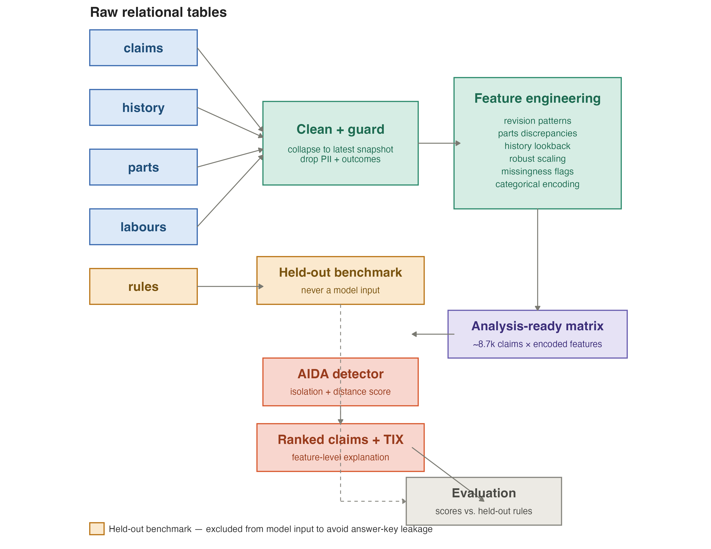

# Explainable Anomaly Detection for Motor Insurance Claims

An unsupervised pipeline that ranks motor insurance claims by how unusual they
are, and explains each ranking at the level of individual features — without
any labelled fraud data.

Built in R as an MSc thesis project (Applied Data Science, Utrecht University),
in collaboration with an actuarial consultancy working with a motor insurer in
Asia.

---

## The problem

Insurers investigating irregular claims usually rely on a rule engine: a fixed
set of thresholds written by domain experts. Rules are transparent and cheap to
run, but they only catch what someone thought to write down, and they say
nothing about claims that are strange in ways nobody anticipated.

The obvious alternative is supervised learning — except that requires labels,
and confirmed-fraud labels barely exist. Investigations are expensive, most
claims are never examined, and a claim that was never investigated isn't a
negative example. Any model trained on that data learns which claims got looked
at, not which claims were fraudulent.

So the problem here is unsupervised: rank claims by how far they sit from the
bulk of the data, and produce a reason for each ranking specific enough that an
adjuster can act on it. A score with no explanation is not actionable — nobody
opens an investigation because a number was high.

## Approach

**AIDA** (Analytic Isolation and Distance-based Anomaly detection) produces the
anomaly scores. It combines isolation — how easily a point is separated from
the rest — with distance, so it responds to points that are unusual in
combinations of features rather than only along individual axes.

**TIX** (Tempered Isolation-based eXplanation) accompanies AIDA and attributes
each claim's score across the input features, so every flagged claim comes with
a ranked list of what made it unusual.

**Isolation Forest** is the baseline comparator, configured with `ndim = 1` so
the comparison is against classic axis-parallel isolation rather than an
oblique variant.

Both AIDA and TIX are external C++ binaries from the reference implementation;
this repository handles everything around them — building the feature matrix,
writing the input files, reading results back, and mapping contributions to
named features.

### Evaluating without labels

The insurer's existing rule engine is the only external signal available, so it
serves as a **weak-label benchmark** — and is deliberately held out of the model
entirely. The rules table is never joined into the feature matrix. This matters:
if the model can see which rules fired, "does the model agree with the rules"
stops being a question worth asking. A rule firing is not ground truth either —
it doesn't prove fraud, and fraud can occur with no rule firing — so the
benchmark measures *agreement and disagreement*, not accuracy.

## Findings

> **Note:** figures below are placeholders pending a final reconciliation pass —
> fill in from the thesis before publishing. See "Open items" at the bottom.

**The two detectors disagree almost completely.** Spearman rank correlation
between AIDA and Isolation Forest across all claims is ρ ≈ `[0.27 / 0.29 — reconcile]`,
and only one claim appears in both methods' top 100. This is a property of the
algorithm family, not a defect: the two use different notions of "far from
normal", so on high-dimensional mixed-type data they surface different claims.
It does mean that a single unsupervised detector should not be treated as
authoritative.

**AIDA is independent of the rule engine, not a replacement for it.** AUC
against the held-out rules is ≈ 0.46 — essentially no separation — and 28 of
AIDA's top 100 claims fired no rule at all. Read as accuracy that looks like
failure. Read correctly, it's the point: the two systems are picking up
different things, so AIDA's value is as a complement that surfaces claims the
rules structurally cannot.

**Missingness carries signal.** TIX attribution splits roughly 60% to one-hot
categoricals, 26% to missingness indicator flags, and 13% to numeric features.
The low numeric share suggests the robust median/IQR scaling did its job — raw
monetary magnitudes are not dominating the scores. The high missingness share is
substantive: *which fields are blank* on a claim turns out to be informative,
which is why the pipeline encodes missingness explicitly rather than imputing it
away.

## Pipeline

Five relational tables — claims, history, parts, labours, rules — keyed on a
file identifier. Claims is the parent; the rest are one-to-many children.

1. **Load and clean.** Sentinel values (`""`, `"NA"`, `"NULL"`, `"?"`, …)
   converted to real `NA` so missingness is measurable.
2. **Filter.** Latest workflow stage only, car claims only, then collapse
   multiple snapshots per case to the most recent — with the revision history
   retained as engineered features rather than discarded.
3. **Drop by policy.** Direct identifiers, free text, and post-hoc outcome
   fields (claim status, amounts paid) that would leak the resolution the model
   is supposed to be blind to.
4. **Aggregate children.** Each child table reduced to one row per claim:
   parts price discrepancies, labour totals, prior-claim counts and recency.
5. **Engineer features.** Reporting delay, days into policy, claims near policy
   start or end, vehicle age at loss, estimate revision ratios.
6. **Encode missingness.** Fields bucketed into mostly-present / mostly-absent /
   variable bands, each producing an explicit indicator column.
7. **Build the matrix.** Log transform on monetary fields, robust median/IQR
   scaling, one-hot encoding for low-cardinality categoricals and frequency
   encoding above 25 levels, rare levels collapsed.
8. **Score and explain.** Export to the AIDA binary, read scores back, export
   the top-k indices to TIX, read contributions back and map them to feature
   names.

Every feature carries a manifest entry recording whether it came from a numeric
field, a one-hot level, a frequency encoding, or a missingness flag — which is
what makes the TIX attribution breakdown above possible.



## Repository layout

```
R/
  00_run_all.R          run order and the two external-binary pauses
  01_preprocessing.R    load, clean, aggregate, engineer, encode
  02_aida.R             matrix export, Isolation Forest baseline, score re-import
  03_tix.R              outlier export, TIX re-import, per-claim explanations
  04_evaluation.R       method comparison, held-out rules benchmark
  05_figures.R          all figures
  06_export.R           top-100 workbook with plain-language reasons
config_example.R        copy to config.R and fill in local paths
figures/                generated figures
```

Scripts share a single R session — each uses objects the previous one leaves
behind. `00_run_all.R` gives the order and marks the two points where the
pipeline pauses for the C++ binaries.

## Running it

```r
install.packages(c("dplyr", "tidyr", "stringr", "lubridate", "purrr", "tibble",
                   "forcats", "naniar", "skimr", "ggplot2", "writexl", "isotree"))
```

Copy `config_example.R` to `config.R` and set `data_dir` to your data location.
`config.R` is gitignored.

AIDA and TIX are not redistributed here. Obtain the implementation from the
authors' release for the paper cited below, and build it locally:

```bash
brew install gcc
g++-14 -O3 -std=c++17 -o bin/aida <source>.cpp
g++-14 -O3 -std=c++17 -o bin/tix  <source>.cpp
```

Invocation:

```bash
./bin/aida aida_run/claims_input.dat aida_run/claims_scores.dat
./bin/tix  aida_run/claims_input.dat aida_run/claims_input_outliers.dat \
           aida_run/claims_tix.dat
```

## Data

The claims data is proprietary and is **not** included in this repository. No
data file, no derived export, and no per-claim output is committed. The country
and the insurer are not identified. `config.R`, which holds local paths, is
gitignored.

The code is published to show the method and the engineering; it will not run
without access to the underlying data.

## Reference

Souto Arias, L. A., Oosterlee, C. W., & Cirillo, P. (2023). AIDA: Analytic
isolation and distance-based anomaly detection algorithm. *Pattern Recognition*,
141, 109607.

## Acknowledgements

Supervised by Dr. Georg Krempl (Utrecht University), with industry supervision
from the partner consultancy.

## Licence

MIT — see `LICENSE`.

---
