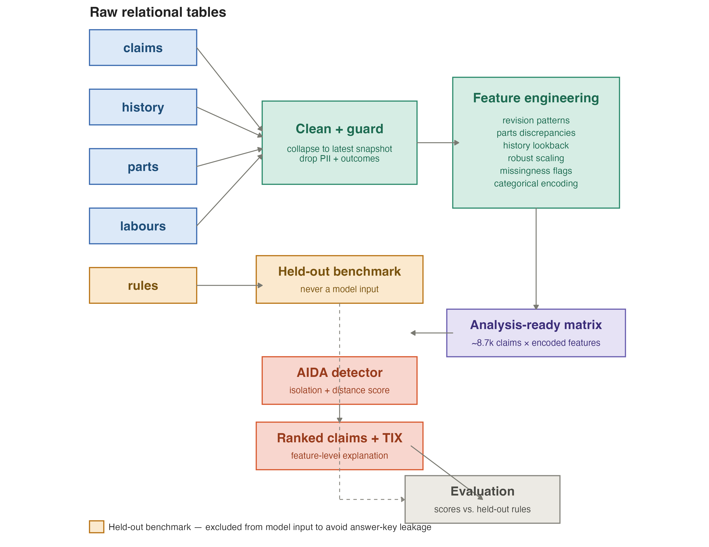

This project ranks motor insurance claims by how unusual they are and explains each ranking at the level of individual features, without any labelled fraud data. It was built in R, in collaboration with an actuarial consultancy working with a motor insurer in Asia.

## The problem

Insurers usually screen claims with a rule engine: a fixed set of thresholds written by domain experts. Rules are transparent and cheap to run, but they only catch what someone thought to write down, and they miss claims that are strange in ways nobody anticipated.

Supervised learning would need labels, and confirmed fraud labels barely exist. Most claims are never investigated, and a claim nobody looked at is not a negative example. A model trained on that data learns which claims got investigated, not which ones were fraudulent.

So the task is unsupervised: rank claims by how far they sit from the bulk of the data, and give a reason for each ranking that a claims adjuster can act on. A high score without an explanation is not enough to open an investigation.

## Approach

**AIDA** (Analytic Isolation and Distance-based Anomaly detection) scores each claim. It combines two ideas: how easily a claim can be separated from the rest, and how far it sits from other claims. That lets it pick up claims that are unusual in a combination of features, not only on one feature at a time.

**TIX** (Tempered Isolation-based eXplanation) splits each claim's score across the input features, so every flagged claim comes with a ranked list of what made it unusual.

**Isolation Forest**, in its classic axis-parallel form, is the baseline for comparison.

AIDA and TIX are C++ programs from the authors' reference implementation. This repository does everything around them: building the feature matrix, writing their input files, reading the results back, and mapping contributions to named features.

## Evaluating without labels

The insurer's existing rule engine is the only outside signal, so it serves as a weak benchmark. The rules table is kept out of the model entirely, because if the model could see which rules fired, agreement with the rules would mean nothing. A fired rule is not proof of fraud either, so the benchmark measures agreement and disagreement, not accuracy.

## What it found

- The two detectors largely disagree about which claims are unusual, so no single unsupervised detector should be treated as the final word.
- AIDA's ranking is largely independent of the rule engine. It complements the rules by surfacing claims they never flag, rather than replacing them.
- Missing values carry signal. Which fields are blank on a claim turns out to be informative, which is why the pipeline encodes missingness explicitly instead of imputing it away.

## Pipeline

1. **Load and clean.** Sentinel values such as `""`, `"NA"` and `"?"` become real missing values, so missingness can be measured.
2. **Filter.** Car claims only, latest workflow stage, one row per case, with the revision history kept as features.
3. **Drop by policy.** Direct identifiers, free text, and outcome fields such as claim status and amounts paid, which would leak how the claim was resolved.
4. **Aggregate.** Parts, labour and claim history tables reduced to one row per claim.
5. **Engineer features.** Reporting delay, days into the policy, claims near the start or end of a policy, vehicle age, estimate revisions.
6. **Encode missingness** as explicit indicator columns.
7. **Build the matrix.** Log transforms on money fields, robust median and IQR scaling, one-hot encoding, and frequency encoding for categories with more than 25 levels.
8. **Score and explain** with AIDA and TIX, then map the contributions back to named features.

Every feature has an entry in a manifest recording where it came from: a numeric field, a category level, a frequency encoding or a missingness flag. That manifest is what makes the attribution breakdown on the Evaluation page possible.

## Data and reproducibility

The claims data is proprietary and is not in the repository. No data file, derived export or per-claim output is committed, and the country and insurer are not identified. Local paths live in a `config.R` file that is excluded from version control.

Package versions are pinned with `renv`. Run `renv::restore()` to install them, then `quarto render` to rebuild this site. The pipeline itself needs the data and the AIDA and TIX programs, so outside readers can inspect the code and the results but cannot rerun the analysis.

### Known limitation

The scripts share one R session and pass objects to each other implicitly, so a script cannot be run on its own. The next improvement is to give each script explicit inputs and outputs, or to move the pipeline to `targets`.

## Reference

Souto Arias, L. A., Oosterlee, C. W., & Cirillo, P. (2023). AIDA: Analytic isolation and distance-based anomaly detection algorithm. *Pattern Recognition*, 141, 109607.

Source code: [github.com/aay-shar/aida-tix-anomaly-detection](https://github.com/aay-shar/aida-tix-anomaly-detection)
